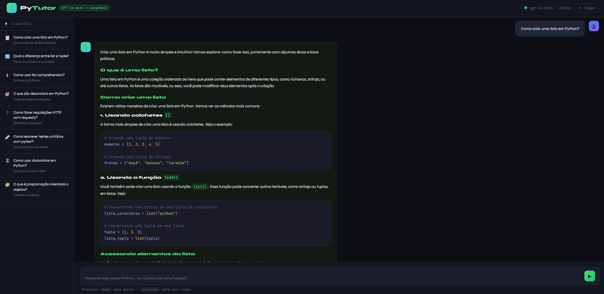
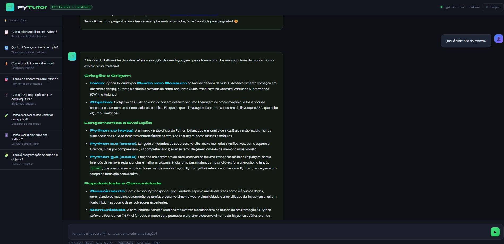
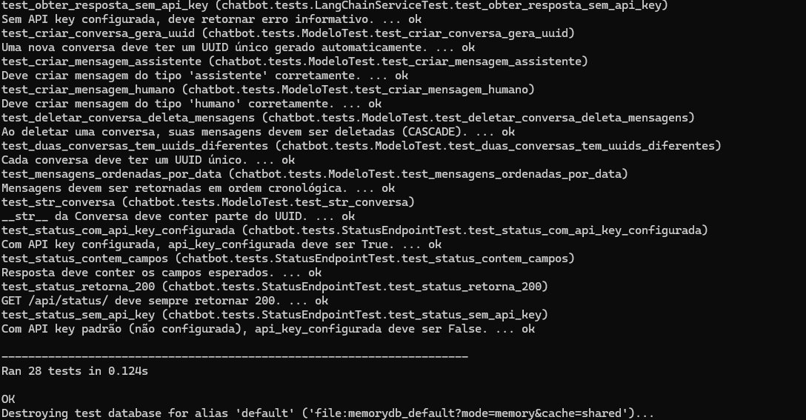

# 🐍 PyTutor — Chatbot de Python com IA

Chatbot especialista em Python usando **LangChain + GPT-4o-mini + Django**, com interface visual moderna e histórico de conversas persistente.

## 🎬 Demonstração

### 💬 Respondendo perguntas sobre Python
> Pergunta: *"Como criar uma lista em Python?"*



A IA responde com explicação detalhada, exemplos de código com syntax highlight e boas práticas — tudo formatado em Markdown renderizado.

---

### 🧠 Contexto de conversa (memória)
> Pergunta: *"Qual é a história do Python?"*



O chatbot mantém o **histórico da conversa** salvo no banco SQLite, permitindo perguntas de acompanhamento com contexto completo.

---

### ✅ Testes Unitários — 28/28 passando



Cobertura completa com **mocks da API OpenAI** — testes rápidos, gratuitos e independentes de rede.

---

## 🛠️ Tecnologias

| Tecnologia | Papel |
|---|---|
| Django + DRF | Backend / API REST |
| LangChain | Orquestração do fluxo de IA |
| OpenAI GPT-4o-mini | Modelo de linguagem (LLM) |
| LangSmith | Monitoramento e rastreamento (opcional) |
| SQLite | Persistência do histórico |

## 📁 Estrutura do Projeto

```
python_tutor_chatbot/
├── core/                        # Configurações Django
│   ├── settings.py              # Config + OpenAI + LangSmith
│   └── urls.py
├── chatbot/                     # App principal
│   ├── langchain_service.py     # ← CORAÇÃO DA IA (LangChain + Prompt)
│   ├── models.py                # Conversa + Mensagem (histórico)
│   ├── views.py                 # Endpoints da API
│   ├── serializers.py           # Validação dos dados
│   ├── urls.py                  # Rotas
│   └── tests.py                 # 28 testes unitários com mock
├── templates/chatbot/
│   └── index.html               # Interface visual do chat
├── docs/screenshots/            # Imagens desta documentação
├── .env.example
├── requirements.txt
└── README.md
```

---

## 🚀 Como rodar

### 1. Clone e entre na pasta
```bash
git clone https://github.com/SEU_USUARIO/python_tutor_chatbot.git
cd python_tutor_chatbot
```

### 2. Crie e ative o ambiente virtual
```bash
python -m venv venv

# Linux/macOS
source venv/bin/activate

# Windows
venv\Scripts\activate
```

### 3. Instale as dependências
```bash
pip install -r requirements.txt
```

### 4. Configure as variáveis de ambiente
```bash
cp .env.example .env
# Edite o .env e insira sua chave da OpenAI
# Obtenha em: https://platform.openai.com/api-keys
```

Conteúdo do `.env`:
```env
OPENAI_API_KEY=sk-sua-chave-real-aqui

# Opcional — LangSmith (monitoramento)
LANGCHAIN_TRACING_V2=true
LANGCHAIN_API_KEY=ls-sua-chave-aqui
LANGCHAIN_PROJECT=python-tutor-chatbot
```

### 5. Crie o banco de dados
```bash
python manage.py migrate
```

### 6. Inicie o servidor
```bash
python manage.py runserver
```

Acesse **http://localhost:8000** — o chatbot abre automaticamente!

---

## 🔗 Endpoints da API

| Método | Endpoint | Descrição |
|--------|----------|-----------|
| GET | `/` | Interface visual do chatbot |
| POST | `/api/chat/` | Enviar pergunta e receber resposta da IA |
| GET | `/api/historico/<session_id>/` | Carregar histórico da conversa |
| DELETE | `/api/historico/<session_id>/limpar/` | Limpar histórico |
| GET | `/api/status/` | Status da API e configurações |

---

## 📖 Exemplo de uso da API

### Enviar pergunta
```bash
curl -X POST http://localhost:8000/api/chat/ \
  -H "Content-Type: application/json" \
  -d '{"pergunta": "Como criar uma lista em Python?"}'
```

### Resposta
```json
{
  "session_id": "550e8400-e29b-41d4-a716-446655440000",
  "pergunta": "Como criar uma lista em Python?",
  "resposta": "## Criando Listas em Python\n\nEm Python, uma lista é criada com colchetes `[]`...",
  "sucesso": true,
  "erro": null
}
```

### Continuar a mesma conversa (com contexto)
```bash
curl -X POST http://localhost:8000/api/chat/ \
  -H "Content-Type: application/json" \
  -d '{
    "session_id": "550e8400-e29b-41d4-a716-446655440000",
    "pergunta": "E como adicionar itens nessa lista?"
  }'
```

---

## 🧪 Rodando os testes

```bash
python manage.py test chatbot -v 2
```

**Resultado: Ran 28 tests → OK** ✅

### Por que usamos mocks nos testes?
A IA (OpenAI) é um serviço externo e pago. Testar com chamadas reais seria lento, custoso e instável. Com `unittest.mock`, simulamos as respostas da IA e testamos apenas a **lógica do nosso código**.

### Cobertura dos testes

| Classe | Testes | O que cobre |
|--------|--------|-------------|
| `LivroModelTest` | 4 | Model, campos, __str__, auditoria |
| `LangChainServiceTest` | 4 | Chain LangChain, mocks, erros |
| `ChatEndpointTest` | 7 | POST /api/chat/, validações, sessões |
| `HistoricoEndpointTest` | 4 | GET/DELETE histórico |
| `StatusEndpointTest` | 4 | GET /api/status/ |
| `ModeloTest` | 5 | Conversa, Mensagem, CASCADE |
| **Total** | **28** | **Cobertura completa** |

---

## 🧠 Como funciona o LangChain

```
Pergunta do usuário
        ↓
ChatPromptTemplate
  (system prompt + histórico + pergunta)
        ↓
ChatOpenAI (GPT-4o-mini)
        ↓
StrOutputParser (texto limpo)
        ↓
Resposta para o usuário
```

O **histórico** é carregado do banco SQLite e convertido para `HumanMessage`/`AIMessage` do LangChain, dando memória ao chatbot.

---

## 📊 LangSmith (Monitoramento opcional)

Com `LANGCHAIN_TRACING_V2=true`, cada chamada à API é registrada no painel do LangSmith em https://smith.langchain.com, mostrando prompt enviado, resposta recebida, tokens consumidos e latência.

---

## 💬 Exemplos de perguntas

- "Como criar uma lista em Python?"
- "Qual a diferença entre `list` e `tuple`?"
- "Como usar list comprehension?"
- "O que são decorators em Python?"
- "Como fazer requisições HTTP com `requests`?"
- "Como escrever testes unitários com pytest?"
- "Explique orientação a objetos com exemplos"
